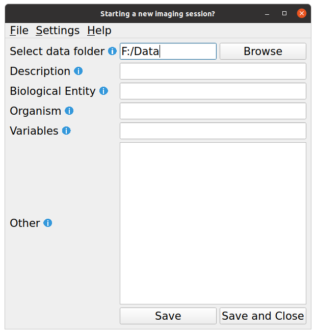
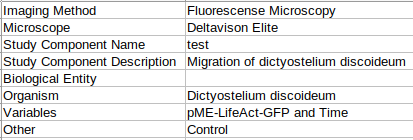

The CAMDU Metadata Collection app collects essential metadata for bioimages.

# Getting Started

Fill in the requested details. Hovering over the blue "i" icons will give more information about what should be entered into each box. Only _Select data folder_ is required, all other details are optional. When you are finished, click the _Save_ button. The window will remain open so that you can continue editing the metadata during the imaging session. At the end of the imaging session, click _Save and Close_ to close the app.
 

##### Select data folder
This is the folder where you will be storing your image data. Click the _Browse_ button to open the file browser to browse for a folder or create a new folder for your imaging session.

##### Description
Here you should describe your imaging session. Briefly describe what you are aiming to achive

##### Biological Entity
State what you are imaging. You should use an ontology such as the [Experimental Factor Ontology](https://www.ebi.ac.uk/efo/). You can search for approriate entries using the [Ontology Lookup Service](https://www.ebi.ac.uk/ols/ontologies/efo)

##### Organism
State the species of your sample(s). You should use a [taxonomy](https://www.ncbi.nlm.nih.gov/taxonomy).

##### Variables
List the variables in your study. These could be intrinsic (e.g. genetic), extrinsic (e.g. reagent) or experimental (e.g. time). You should use [ontology entries](https://www.ebi.ac.uk/ols/ontologies/efo) if possible.

##### Other
Here you can include any other information about your imaging session. For example, if you are using abbreviations in file names you could include the definitions here. You could also include information about the preparation of the sample, how signal is generated or what each channel shows.

# Output
After clicking _Save_ a file called **Metadata.csv** will be created in the selected data folder. This can be opened in a text or spreadsheet editor. This will include all the details that you entered, as well as a few that are specific to the imaging system used. An example of the **Metadata.csv** may look something like this:

> Imaging Method,Fluorescense Microscopy \
> Microscope,Deltavison Elite \
> Study Component Name, C001_Dicty \
> Study Component Description,Migration of dictyostelium discoideum \
> Biological Entity, \
> Organism,Dictyostelium discoideum \
> Variables,pME-LifeAct-GFP and Time \
> Other,Control

or like this in a spreadsheet.

The keys in the table are taken from the Study Component and Biosample sections of [Recommended Metadata for Biological Images (REMBI)](https://www.nature.com/articles/s41592-021-01166-8) guidelines. The "Imaging Method" and "Microscope" values are defined in the app _Settings_ (see below for details) and relate to the imaging system. The "Study Component Name" is automatically pulled from the data folder selected. The other values are the information inputted by the user. Here the biological entity has been left blank as the whole organism was imaged.

# Loading exisiting metadata file
If your imaging session is similar to one you undertook previously, or you have made some changes that you want to revert (and haven't yet pressed save) you can load an exisitng **Metadata.csv** file into the app. Go to File > Load and navigate in the file browser to the required **Metadata.csv** file. Then click _OK_. The contents of the metadata.csv file will be imported into the app.

# Settings
The values in _Settings_ will apply to all users, so only admins should alter the settings. To change the settings go to Settings > Change Settings. A pop up box will open asking for:

##### Select default data folder
This should be set to the data drive of the microscope and will be the default location for saving the **Metadata.csv** file until the user selects a specific data folder.

##### Text Box
The text box below allows any text to be entered. Here, comma separated key value pairs should be entered that describe the imaging system. These details will be added to all metadata files for all users.

# References
Sarkans, U., Chiu, W., Collinson, L. et al. REMBI: Recommended Metadata for Biological Images—enabling reuse of microscopy data in biology. Nat Methods 18, 1418–1422 (2021). https://doi.org/10.1038/s41592-021-01166-8

Malone J, Holloway E, Adamusiak T, Kapushesky M, Zheng J, Kolesnikov N, Zhukova A, Brazma A, Parkinson H: Modeling Sample Variables with an Experimental Factor Ontology. Bioinformatics 2010, 26(8):1112-1118

Jupp S. et al. (2015) A new Ontology Lookup Service at EMBL-EBI. In: Malone, J. et al. (eds.) Proceedings of SWAT4LS International Conference 2015

Schoch CL, et al. NCBI Taxonomy: a comprehensive update on curation, resources and tools. Database (Oxford). 2020: baaa062. PubMed: 32761142 PMC: PMC7408187
